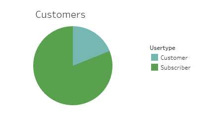
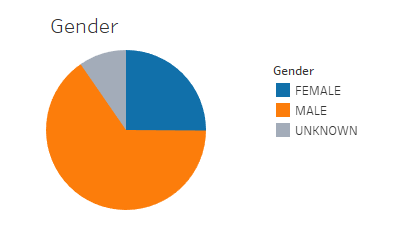
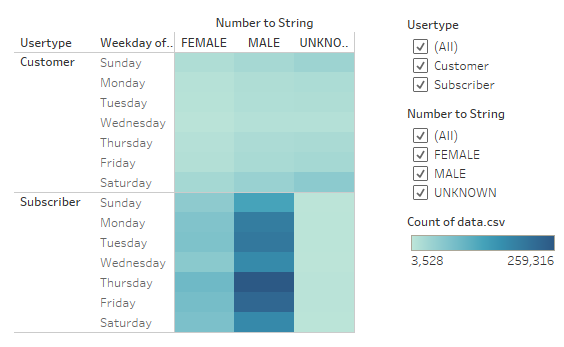
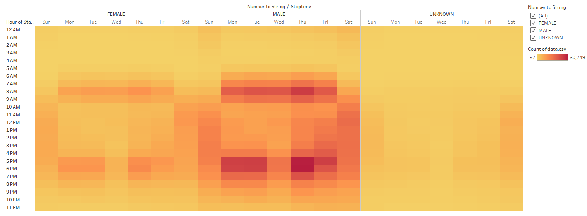
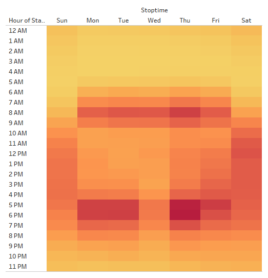
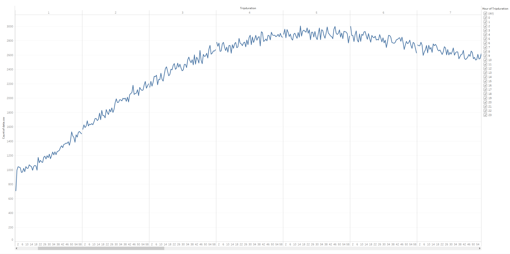
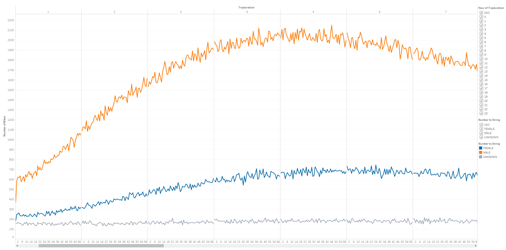

# Bikesharing

## Challenge Overview
You are to create a set of visualizations that show:
- the length of time that bikes are checked out for all riders and genders
- the number of bike trips for all riders and genders for each hour of each day
- the number of bike trips for each type of user and gender for each day of the week

## Resources
- data.csv (edited datetime from 201908-citibike-tripdata.csv)
- Software: Tableau Public 2020.3, Jupyter Notebook 6.0.3, Python 3.7.7, Visual Studio Code 1.47.2

## Challenge Results
[Here is the link to the story](https://public.tableau.com/views/BikeTripsAnalysisChallenge/BikeTripsAnalysis?:language=en&:retry=yes&:display_count=y&:origin=viz_share_link)

Customer Breakdown | Gender Breakdown
:-----------------:|:----------------:
 | 

We can see most of our customers are subscribers and males.

Bikes are used throughout the week with the most frequent days being Thursday and Friday.

Bikes are used mostly by males. Also the most popular times are during commute hours, namely 8 a.m. and 5-6 p.m.

Here, we can see the same thing as the previous heatmap. Bikes are mostly used during commute hours on the weekdays and during the afternoon on weekends.

Bikes are mostly checked out during the early hours, between 4 a.m. and 7 a.m.

The same information is shown from the previous graph but this graph also shows that males use bikes more than females.

## Challenge Summary
From these visualizations, we can see that many bike users are already subscribers and many of the users are male. The most frequent time bikes are used on the weekdays are during commute hours, 8 a.m. and between 5-6 p.m. On the weekends, bikes are mostly used during mid-morning and throughout the afternoon. Two additional visualizations that I would perform would be the top starting and ending locations. This would help determine where to service bikes after they are done being used and where to best allocate the bikes for higher usage.